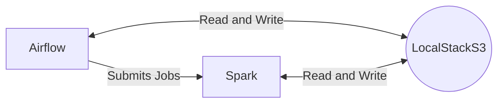

# Entregable 3

## Setup

Para levantar Airflow necesitamos:

- Configurar el usuario y las carpetas necesarias:

```bash
mkdir -p ./logs ./plugins ./config
echo -e "AIRFLOW_UID=$(id -u)" > .env
```

- Inicializar la base de datos de Airlfow:

```bash
docker compose up airflow-init
```

- Ya estamos en condiciones de correr Airflow:

```bash
docker compose up
```

Ahora podemos acceder a la UI de Airflow desde `localhost:8080`.
Vamos a configurar, desde la UI, las variables que necesita el DAG:

- Vamos a `Admin` > `Variables`.
- Podemos importar `variables.json` desde el botón `Import Variables` o
  crearlas manualmente, una por una.

## Arquitectura



## DAG

## Conclusiones
