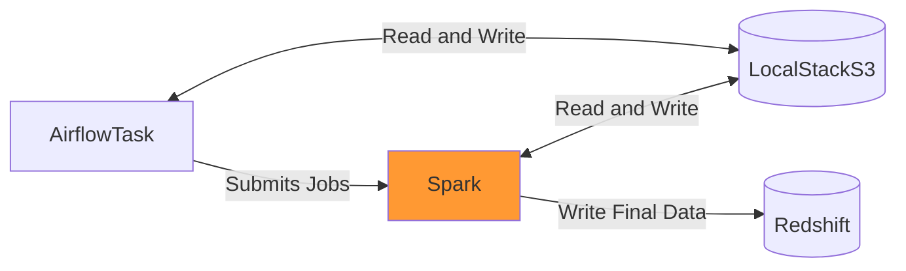

# Entregable 3

## Setup

Para levantar Airflow necesitamos:

- Configurar el usuario y las carpetas necesarias:

```bash
mkdir -p ./logs ./plugins ./config
echo -e "AIRFLOW_UID=$(id -u)" > .env
```

- Inicializar la base de datos de Airlfow:

```bash
docker compose up airflow-init
```

- Ya estamos en condiciones de correr Airflow:

```bash
docker compose up
```

Ahora podemos acceder a la UI de Airflow desde `localhost:8080`.
Vamos a configurar, desde la UI, las variables que necesita el DAG:

- Vamos a `Admin` > `Variables`.
- Podemos importar `variables.json` desde el botón `Import Variables` o
  crearlas manualmente, una por una.

## Arquitectura



Tenemos 3 componentes:

- Airflow: orquesta las tareas en el esperado.
- Spark: lee los datos de la API, realiza algunas transformaciones
  y carga los datos finales en Redshift.
- LocalStack: para emular S3. Repositorio en el que las tareas
  de Airflow y Spark van a guardar y leer los datos de la API en sus
  distintas etapas. Ya que pasar otra cosa que no sea metadata por
  XCom es una mala idea me pareció oportuno simular una forma
  de uso que podría acercarse más a un DAG en producción.

## DAG

```mermaid
grap LR
    A[create_s3_bucket] --> B[get_motorcycles_data]
    B --> C[transform_motorcycles_data_with_spark]
    C --> D[load_motorcycles_data_in_redshift]
    E[create_redshift_table] --> D
```

## Conclusiones
